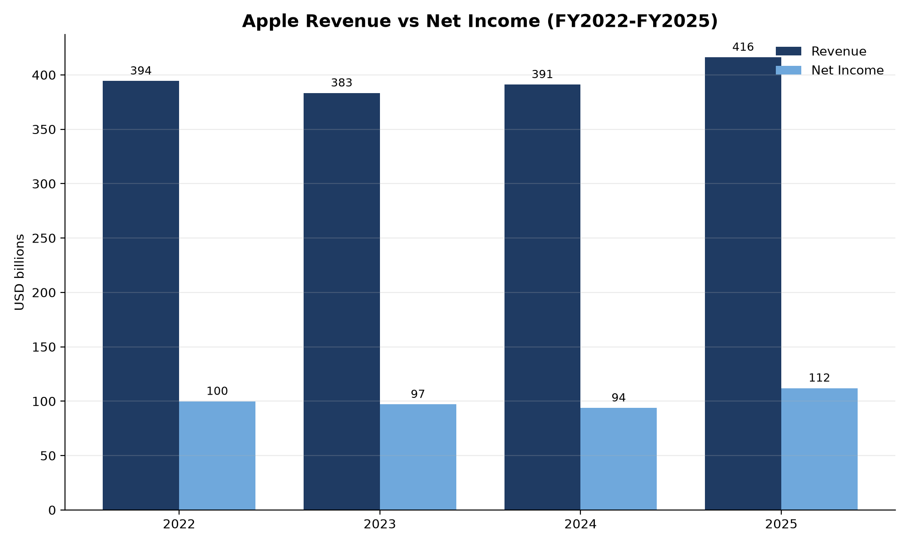
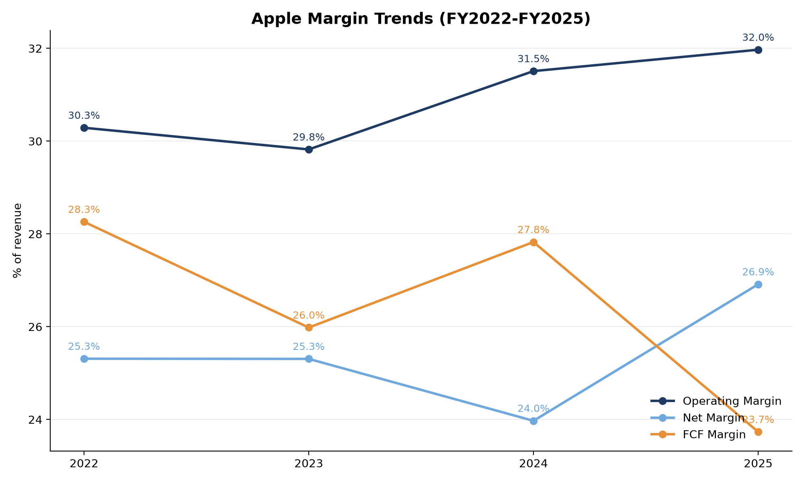
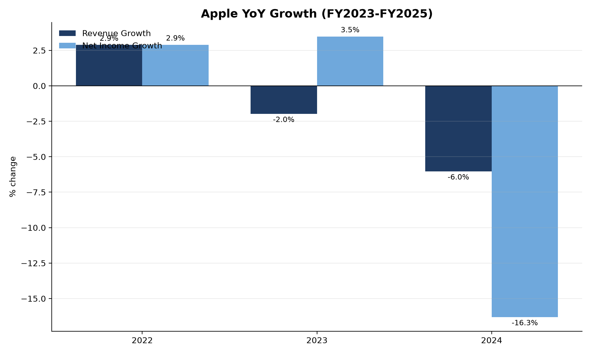
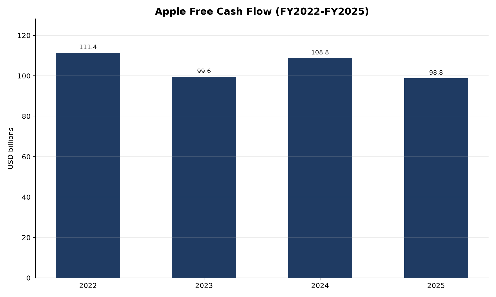
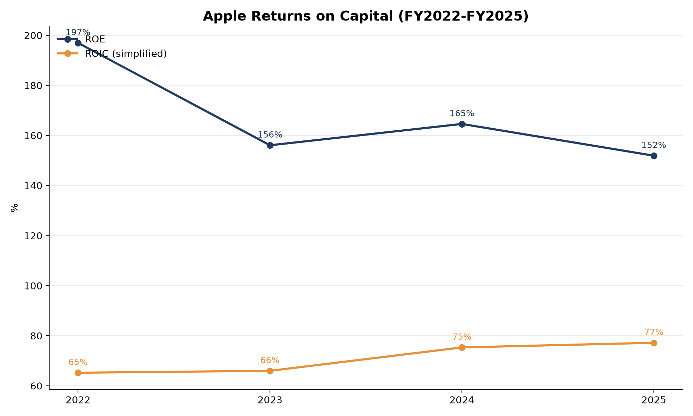

# Apple Inc. Financial Analysis (FY2022-FY2025)

A Python analysis of Apple's growth, profitability, cash flow, leverage and returns on capital, built with pandas and matplotlib.

## Overview

This project takes Apple's annual financial statements for FY2022-FY2025 and turns them into a set of analyst-style metrics and charts. It covers how fast the business is growing, how profitable it is, how much cash it generates, how leveraged it is, and how efficiently it uses capital.

## Data and method

- **Data source:** Yahoo Finance
- **Period:** Fiscal years 2022-2025 (fiscal years end in September)
- **Units:** USD billions
- **Tools:** Python, pandas, NumPy, matplotlib, Jupyter

### Metrics calculated

| Metric | Formula |
|---|---|
| Revenue Growth | Year-over-year % change in revenue |
| Net Income Growth | Year-over-year % change in net income |
| Operating Margin | Operating income / Revenue |
| Net Margin | Net income / Revenue |
| FCF Margin | Free cash flow / Revenue |
| Debt to Equity | Total debt / Equity |
| ROE | Net income / Equity |
| ROIC (simplified) | Operating income / (Equity + Total debt) |

## Key findings

1. **Growth was flat, then accelerated.** Revenue fell about 2.8% in FY2023, rose about 2.0% in FY2024, then grew about 6.4% in FY2025 to $416B. Net income fell in FY2023 and FY2024, then jumped about 19.5% in FY2025 to $112B, so earnings grew much faster than sales.
2. **Profitability is high and stable.** Operating margin stayed between 29.8% and 32.0%, peaking at 31.97% in FY2025. Net margin ranged from 24.0% to 26.9%, with FY2024 the low point.
3. **Cash generation is strong but softened in FY2025.** FCF margin ran between 23.7% and 28.3%. It was lowest in FY2025 even as net margin rose, which suggests weaker cash conversion relative to reported earnings.
4. **Leverage has fallen sharply.** Debt to Equity dropped from 2.61 in FY2022 to 1.34 in FY2025.
5. **Returns on capital are exceptionally high.** ROE ranged from about 152% to 197%, but this is inflated by share buybacks shrinking book equity. The simplified ROIC, which rose from about 65% to 77% over the period, is the more meaningful measure and still points to a very capital-efficient business.

## Charts

### Revenue vs Net Income


### Margin Trends


### Year-over-Year Growth


### Free Cash Flow


### Returns on Capital


## Limitations

- Only four fiscal years of data, so the trends are indicative rather than statistically meaningful.
- ROE is distorted by buybacks, which reduce book equity.
- ROIC is simplified: it uses operating income rather than NOPAT, and total debt plus equity without adjusting for cash.
- Figures come from reported financial statements with no adjustments for one-off items.

## Run it yourself

```bash
pip install pandas numpy matplotlib jupyter
jupyter notebook
```

Then open the notebook and choose Kernel > Restart & Run All.
